# Some-Fundamental-Unix-command

 
The command line is a text interface for your computer. It’s a program that takes in commands, which it passes on to the computer’s operating system to run. Here,I am putting up some fundamental Unix Command

## Creating new File

You can create a file by typing touch file_name and executing it.
 
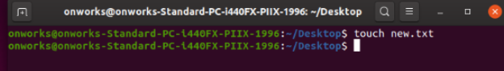
 

## Displaying a file
you can display the content of a file with the cat command by typing cat file_name.
 
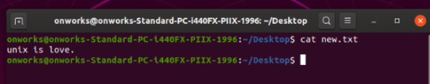
 

## Creating new Folder
You can create a new directory/folder using mkdir command. Use **mkdir directory_name.**
 
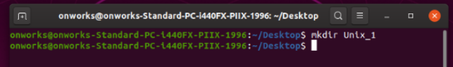
 

## Moving Between Directories
You can use the **cd** command to move to other directories. By entering **cd** directory_name, you can move to the specified directory.
Note:The current directory is displayed to the left of **$**.
 
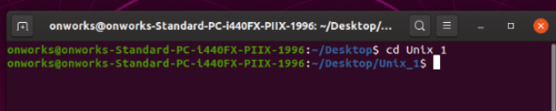
 

## Checking the Current Directory
For checking the present working directory you can use **pwd** command.
When you execute the **pwd** command , all directories from the root directory to the current directory are displayed.
 
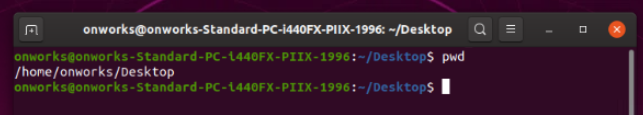
 

## Displaying Contents of Directory
For displaying the contents of a directory you can use **ls** command.
 
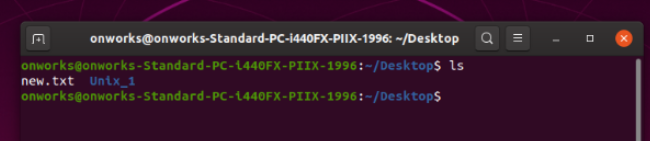
 

## The Parent Directory
To move to the parent directory, you can use command like **cd ..**
Note: If you execute **cd** without specifying a directory, you can move to home directory.
 
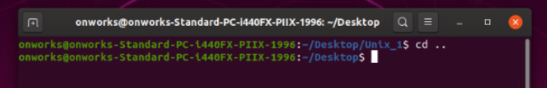
 

## Working with files and folders
### Moving files
By typing , **mv [options] source dest** you can move a file to the specified directory.
 
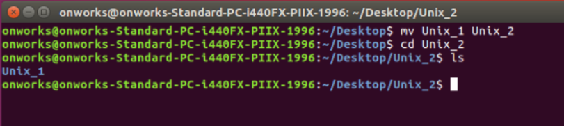
 

### Renaming a file
**mv** command can also be used for renaming a file.
You can rename a file by typing **mv old_file_name new_file_name**.
 
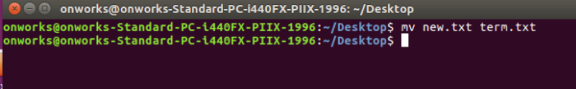
 

### Copying a file-
To copy files you can use **cp** command,you can type **cp old_file_name new_file_name**.
 
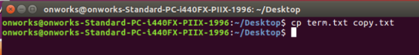
 

### Removing a file-
To remove a file you can use **rm** command.The command is **rm file_to_remove** .
 
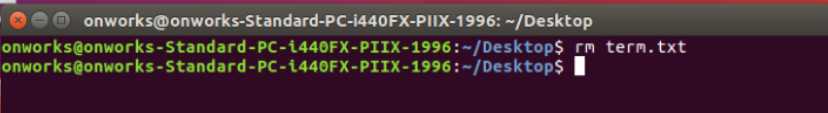
 

And Here it ends…..💙💙💙
